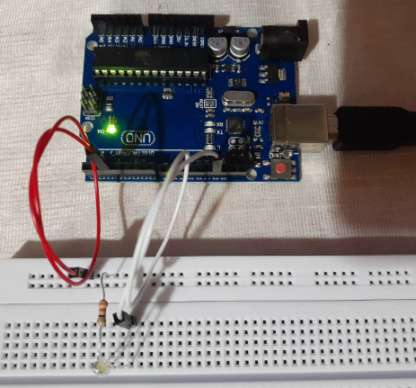
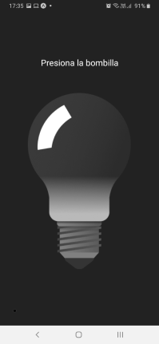

# Wireless LED Control System

Uses a serial COM port to turn on/off a LED through Arduino and Node.js via HTTP.

## Install Dependencies
Run `yarn install` in both directories `lightbulb.api` and `lightbulb.apk`.

## Start the App & API

**Note:** Execute the Arduino code before starting the API.

1. Set the **COM_PORT** environment variable.
    Then go to the `lightbulb.api` directory and run `yarn start`.
2. Start the Metro bundler by running `yarn start` inside the `lightbulb.apk` directory.

## Screenshots

## References & Resources
  - Inspiration: https://www.hackster.io/ryanchan/recordable-cardboard-robot-arm-c7fbc0
  - Arduino serial COM reference: https://www.arduino.cc/reference/en/language/functions/communication/serial/
  - Node.js serial COM package: https://serialport.io/
  - App boilerplate: https://docs.expo.io/
  - App: https://reactnative.dev/
  - Light bulb images taken from: https://freesvg.org/1434619451
